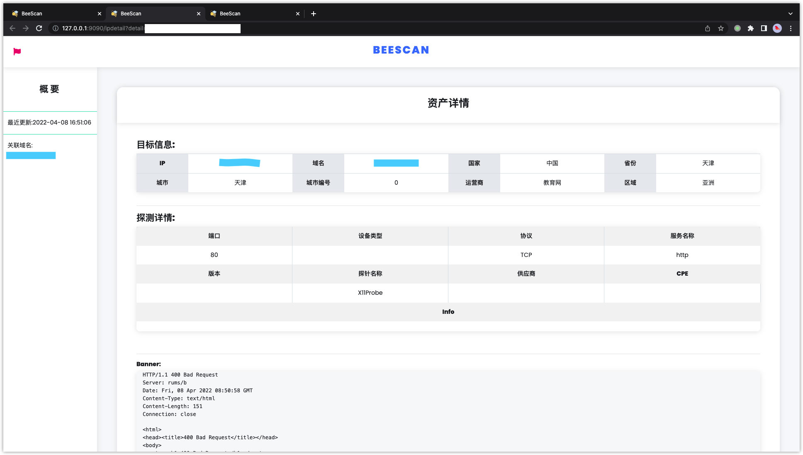
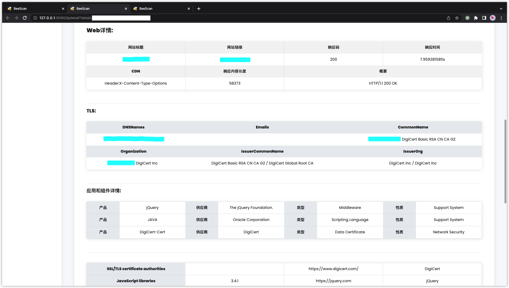
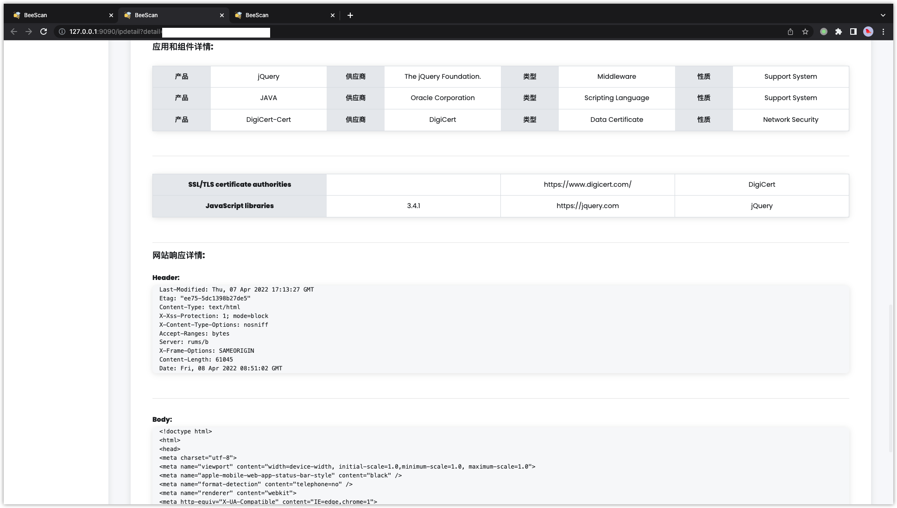

# BeeScan（展示端）

## 简介

BeeScan是一款基于Go语言的网络空间资产探测工具、不同于其他的集成类工具，BeeScan的所有资产探测部分都是代码实现，而不是简单的工具集成，简化了部署的环境要求，同时BeeScan支持分布式节点扫描，从而大大增加了资产探测的效率。工具分为展示端和扫描端。此为展示端，扫描端在[BeeScan-scan](https://github.com/jiaocoll/BeeScan-scan)。展示端和扫描端的分离可实现分布式部署扫描端，从而提高扫描的效率。

展示端采用的是gin框架编写的后端服务。笔者前端比较差，所以前端就没有使用vue等技术（等以后有空学了然后重构），整体项目是比较偏小的，且用户得到的就是一个二进制程序，所有静态文件都已打包到程序中。

## 流程设计

## 特点

- 全文关键词搜索
    - title=""
    - body=""
    - header=""
    - domain=""
    - ip=""
    - app=""
    - servername=""
    - port=""
    - country=""
    - city=""
    - org=""
    - province=""
    - region=""
    - ······更多搜索语法等你探索

- 整合统计资产，关联每个IP的绑定域名资产
- 扫描节点分布式扫描，大幅度提高效率
- 调用nuclei漏洞扫描，让用户采用自己的语法规则从数据库中搜索相应资产进行漏洞扫描
- 实时监控各个扫描节点的运行状态

## 展示端功能

### 资产展示

主要是用来展示扫描端已经扫描到的结果，对已经扫描的结果进行统计，包括，国家统计、端口统计、服务统计。由于数据库使用的是elasticsearch数据库。可实现关键词全文搜索。除此之外，还提供了资产导出的功能，可对已经探测到的资产进行目标的导出。

> 部分搜索语法：
>
> title=""
>
> body=""
>
> header=""
>
> domain=""
>
> ip=""
>
> app=""
>
> servername=""
>
> port=""
>
> country=""
>
> city=""
>
> province=""
>
> region=""
>
> 语法之间可用 &&（且）和 ||（或）进行联合

### 任务发布

通过在任务发布页面进行目标的输入可发布任务，用户需要输入的包括目标（域名、ip、网址），端口（可选），指定节点（选择空闲节点），任务名称。

### 节点状态

在任务发布页面可查看每个节点当前的实时运行状态，Free（空闲），Invaild（失效），Running（运行）

### 漏洞扫描

在漏洞扫描页面，输入相应的资产搜索语法规则，输入任务名称，即可调用nuclei进行漏洞扫描（目前只做了调用nuclei，后续会加入其他漏洞扫描模块，鉴于poc维护不易，所以这里调用的是拥有较为完善生态的漏扫工具。）扫描的结果入库，然后在漏洞扫描页面进行相关漏洞的查看，同时可进行漏洞的搜索。

### 日志查看

可查看展示端运行日志和每个扫描节点的运行日志。从而了解节点都进行了哪些操作，或者进行排错处理。

### 本机信息

输出当前运行展示端的主机的详细信息，包括（系统、框架、存储空间、内存占用情况、实时网卡网速监控）

## 扫描端功能

### 主机存活

- 多方式探测（ICMP、Ping、HTTP）

### 端口探测

- tcp/udp

### 服务识别

- 多模块探测

- 不同服务不同指纹对比，减少重复发包，提高效率

- 使用浏览器爬虫探测

- 丰富的指纹库

### 定期扫描

- 定期扫描数据库中超过一定时间的旧资产，保证资产的时效性

### IP归属信息

- 内置IP归属查询数据库，无需进行联网查询

## 展示端页面

### 登录页面

### 本机信息页面

### 资产展示页面

### 资产详情页面

### 任务发布和节点状态页面

### 漏洞扫描页面

### 日志页面

## 如何使用

### 1.部署数据库

对于用户来说，需要部署redis和elasticsearch数据库

### 2.下载二进制程序

然后从release中下载相应系统的运行包，然后运行二进制程序，首次运行会在工具所在的目录生成config配置文件，然后修改配置文件中数据库的地址和端口即可。之后直接运行二进制程序即可。当然，可能你需要了解一下config中的配置信息，因为其中包含节点的信息。

## 免责声明

本工具仅面向**合法授权**的企业安全建设行为，如您需要测试本工具的可用性，请自行搭建靶机环境。

在使用本工具进行检测时，您应确保该行为符合当地的法律法规，并且已经取得了足够的授权。**请勿对非授权目标进行扫描。**

如您在使用本工具的过程中存在任何非法行为，您需自行承担相应后果，我们将不承担任何法律及连带责任。

在安装并使用本工具前，请您**务必审慎阅读、充分理解各条款内容**，限制、免责条款或者其他涉及您重大权益的条款可能会以加粗、加下划线等形式提示您重点注意。 除非您已充分阅读、完全理解并接受本协议所有条款，否则，请您不要安装并使用本工具。您的使用行为或者您以其他任何明示或者默示方式表示接受本协议的，即视为您已阅读并同意本协议的约束。

## Todo

- [ ] 完善前端页面，使用vue进行重构
- [ ] 完善节点监控，后续考虑使用成熟的消息队列
- [ ] 完善扫描端扫描逻辑和扫描效果，增加一个属于自己的指纹库
- [ ] 优化并发

## 参考

- [boyhack](https://github.com/boy-hack)

## 期望

目前该项目还只是个雏形，后面会考虑重构整个项目，努力使项目更完善一些，希望您能不吝啬的给一个star:star:鼓励一下作者后续坚持的开发:smile:。